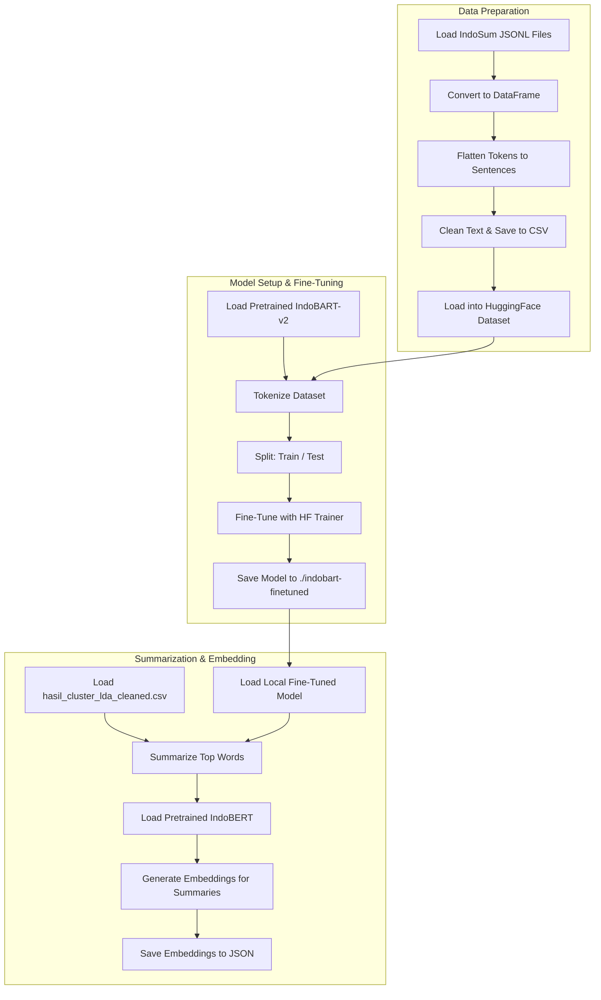

# Session Summary: Indonesian Review Summarization Project

This document provides a comprehensive overview of the analysis performed on the project, designed to give future AI agents immediate context.

## Project Overview
The project is an Indonesian NLP pipeline focused on summarizing customer reviews using a combination of Topic Modeling (LDA) and a fine-tuned Sequence-to-Seqence model (BART).

## Core Dependencies
- **PyTorch & Transformers**: Used for model loading and fine-tuning.
- **IndoBART (indobenchmark/indobart-v2)**: The base model for summarization.
- **IndoBERT (indobenchmark/indobert-base-p1)**: Used for generating sentence embeddings.
- **Gensim & pyLDAvis**: Used for Topic Modeling and visualization.
- **Datasets (Hugging Face)**: For efficient data handling during training.

## Key Workflow Components

### 1. Data Preprocessing (`preprocess.ipynb`)
- Loads raw review data from `dataset_noka/dataset_mentah.csv`.
- Performs cleaning (removing punctuation, lowercase, etc.).
- Saves cleaned data to `dataset_noka/dataset_cleaned.csv`.

### 2. Topic Modeling & Clustering (`clustering_lda.ipynb`)
- Uses LDA (Latent Dirichlet Allocation) to identify topics in the reviews.
- Employs KMeans for further clustering based on word distributions.
- Produces `hasil_cluster_lda_cleaned.csv`, which contains `top_words` for each cluster.

### 3. Model Fine-Tuning (`bert_bart_tuning_word_summarization.ipynb`)
- **Dataset**: Uses the **IndoSum** dataset (approx. 19k news articles).
- **Process**:
    - Flattens hierarchical tokens into sentences.
    - Fine-tunes `indobart-v2` for 5 epochs.
    - Saves the model to `./indobart-finetuned`.
- **Identified Issue**: A `KeyError: 'top_words'` exists in Cell [19]. This occurs because the code attempts to apply summarization to the IndoSum training DataFrame (which lacks the `top_words` column) instead of the LDA results DataFrame.

### 4. Summarization & Evaluation (`bert_bart_word_summarization.ipynb`)
- Loads the fine-tuned model from `./indobart-finetuned`.
- Summarizes the `top_words` from each LDA cluster into coherent sentences.
- Converts these summaries into embeddings using IndoBERT for further analysis.

## Dataset Insights: IndoSum
- Located in `dataset_noka/IndoSum/`.
- Format: JSONL (nested structures for paragraphs and summaries).
- Structure: `{category, gold_labels, id, paragraphs, source, source_url, summary}`.
- Hierarchy: Paragraph -> Sentence -> Word Tokens.

## Mermaid Flowchart of Tuning Pipeline

## Important Notes for Future Sessions
- The files in `dataset_noka/IndoSum/` are large (some > 50MB); use `run_shell_command` with `Get-Content` or similar tools for inspection.
- The `indobart-finetuned/` directory contains the weights of the fine-tuned model and should be protected.
- The project uses a virtual environment located in `.venv\`.
